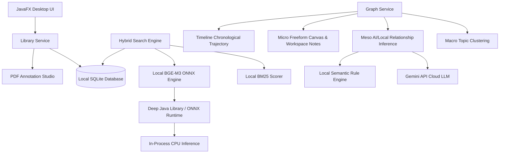

# 🕸️ CiteRight

> **Privacy-First, Local-First AI Research Cognition & Reference Manager**

CiteRight is a modern, high-performance reference manager and academic reading environment designed for researchers, academics, and students. By combining a **local-first SQLite database**, **in-process neural embeddings (BGE-M3)**, and **selective cloud-AI reasoning (Gemini API)**, CiteRight transitions your library from a static storage bin into an interactive, externalized scholarly cognition environment—all running entirely on your local machine with zero mandatory cloud dependencies.

---

## 🚀 Key Features

### 1. 🕸️ Multi-Scale Paper Graph Visualization
CiteRight prevents cognitive overload ("graph hairballs") by enforcing progressive disclosure across four distinct views:
*   **Macro (Topic Landscape):** Renders conceptual "islands" or topic clusters dynamically computed using real-time TF-IDF term clustering. Allows you to see the broad themes of your library at a glance.
*   **Meso (Ego-Centric Reasoning):** Renders a 1-hop or 2-hop semantic neighborhood centered around a selected paper. Visualizes qualitative relationship edges such as `supports`, `contradicts`, `extends`, and `shares methodology` with confidence scores and reasoning.
*   **Micro (Workspace Canvas):** A freeform persistent whiteboard. Pin papers, draw custom relationship links, group items into labeled workspace bounds, and add persistent sticky notes to map out your literature reviews.
*   **Timeline Trajectory:** Maps papers chronologically along a similarity baseline to trace the historical lineage of ideas and methodologies over time.

### 2. 🧠 On-Device Hybrid Semantic Search (BM25 + BGE-M3 Cosine)
CiteRight features a professional hybrid search ranking engine that scores and sorts your library in milliseconds:
*   **Lexical Scorer (BM25 & TF-IDF):** Handles precise keyword and terminology matches across title, abstract, and authors.
*   **Local Neural embeddings:** Computes 1024-dimensional dense semantic vectors locally on your CPU. It executes the state-of-the-art **BGE-M3 multilingual text embedding model** inside the Java process using **Deep Java Library (DJL)** and **ONNX Runtime**.
*   **Custom Score Fusion:** Merges lexical match, semantic cosine similarity, citation counts, recency, and author matching into a single normalized composite score.
*   **Offline Fallback:** The local semantic engine dynamically falls back to lexical keyword analysis when local embeddings are not yet calculated, ensuring uninterrupted offline usage.

### 3. 🤖 Grounded Chat & Selective AI Reasoning
*   **Chat with your Library:** Ask complex synthesis questions grounded entirely in your research. The system retrieves related contexts from local papers and uses Google's Gemini API for semantic answers.
*   **Selectively Executed AI:** High-cost cloud LLM calls are reserved for high-value synthesis (e.g., determining whether Paper A *supports* or *contradicts* Paper B) or user-initiated evidence extraction.
*   **Rate-Limit Aware:** Respects Gemini's free tier quotas (15 RPM / 1,500 RPD). Automatically falls back to the local semantic rule engine when quotas are exhausted.

### 4. 📄 Native PDF Viewer & Annotation Studio
*   **Built-in Reader:** Powered by Apache PDFBox. View papers instantly within the interface without needing external readers.
*   **Interactive Annotations:** Highlight text in yellow, draw freehand over diagrams, or drop note markers directly on PDF pages.
*   **Collapsible Panel:** Keep track of all page annotations in a sidebar, which can be collapsed at any time to maximize reading space.

### 5. 📑 1-Click Citation Generator
*   Instantly copy citations in **APA**, **MLA**, **IEEE**, or **Harvard** formats directly from search cards or the detail panel to your clipboard.

### 6. 📦 Cross-Platform Portability & Custom JRE Bundling
*   Built as a fully self-contained portable application using Java 21's `jpackage`.
*   Includes a trimmed down Java runtime (JRE) containing only the necessary modules, meaning the application **runs out-of-the-box on other devices without installing Java or JavaFX**.

---

## 🏗️ System Architecture



---

## 🛠️ Technology Stack

*   **Core Runtime:** Java 21 (JDK 21 LTS)
*   **Graphics & GUI:** JavaFX 21 (Hardware-accelerated rendering)
*   **Database:** SQLite (embedded, zero-config, highly portable)
*   **Local NLP Engines:** BM25, TF-IDF, TextRank Summarization
*   **Local AI Inference:** Deep Java Library (DJL), ONNX Runtime, HuggingFace Tokenizers
*   **Embeddings Model:** BGE-M3 Multilingual (1024-d dense vectors, locally stored)
*   **Cloud AI Model:** Gemini Pro (via REST API)
*   **PDF Parsing & Annotation:** Apache PDFBox 3.0
*   **Serialization:** Google Gson
*   **Build Tool:** Maven

---

## 📂 Project Directory Structure

```
CiteRight/
│
├── src/main/java/com/citeright/
│   ├── CiteRightApp.java        # Application initialization & GUI root
│   ├── Launcher.java            # Main entry point (workaround for fat JARs)
│   │
│   ├── ai/                      # Local BGE-M3 & cloud Gemini API bindings
│   ├── database/                # SQLite DAOs (Library, Workspaces, Annotations)
│   ├── model/                   # Paper, Relationship, and Note schemas
│   ├── nlp/                     # Lexical scorers, summarizers, text processing
│   ├── ranking/                 # Multi-factor search ranking & fusion logic
│   ├── search/                  # Web APIs (EuropePMC, Crossref, SemanticScholar)
│   └── ui/                      # Custom JavaFX components & graph layouts
│
├── build.bat                    # One-click portable build script
├── run.bat                      # Fast developer run script
├── MANUAL.md                    # Detailed, step-by-step user manual
├── DESIGN_RESEARCH_GRAPH.md     # Architectural design spec for the Paper Graph
└── pom.xml                      # Maven project configuration (jpackage & shading)
```

---

## 🛠️ Development & Build Guide

### Prerequisites
To build the project locally, your development machine requires:
1.  **Java 21 JDK** (configured on your system `PATH`)
2.  **Maven** (configured on your system `PATH`)

### Fast Run (Developer Mode)
To compile and run the application instantly from the source directory, run:
```bash
run.bat
```
*(This is faster than packaging the JRE and runs the fat JAR directly using your local Java environment).*

### Creating a Self-Contained Portable Release
To bundle the JRE and package the application into a distribution zip, run:
```bash
build.bat
```
This script will:
1.  Clean and package the Maven project into a standalone fat JAR (`target/citeright-1.0-SNAPSHOT-standalone.jar`).
2.  Set up a clean staging folder (`target/jpackage-input`) to prevent recursive loops.
3.  Run `jpackage` to bundle a custom-trimmed runtime and compile `CiteRight.exe` with its native icon.
4.  Compress the output folder into a distributable `CiteRight-Portable.zip`.

---

## 📂 Data Storage & Portability

CiteRight is built to protect your privacy and ensure your data remains under your control:
*   **User Directory:** All library assets are stored in the user home directory:
    ```
    C:\Users\YourUsername\.citeright\
    ```
*   **Database:** `library.db` (SQLite) stores all your text metadata, annotations, graph relationships, and whiteboard notes.
*   **PDF Storage:** The `pdfs/` subfolder holds copies of all imported PDF documents.
*   **No Cloud Lock-In:** You can back up or migrate your entire research environment by copying the `.citeright` directory to another machine.

---

## 📄 License
CiteRight is open-source. For more details on the features and how to configure your Gemini API Key, refer to the [MANUAL.md](file:///c:/Users/atifm/OneDrive/Desktop/java%20project/MANUAL.md).
